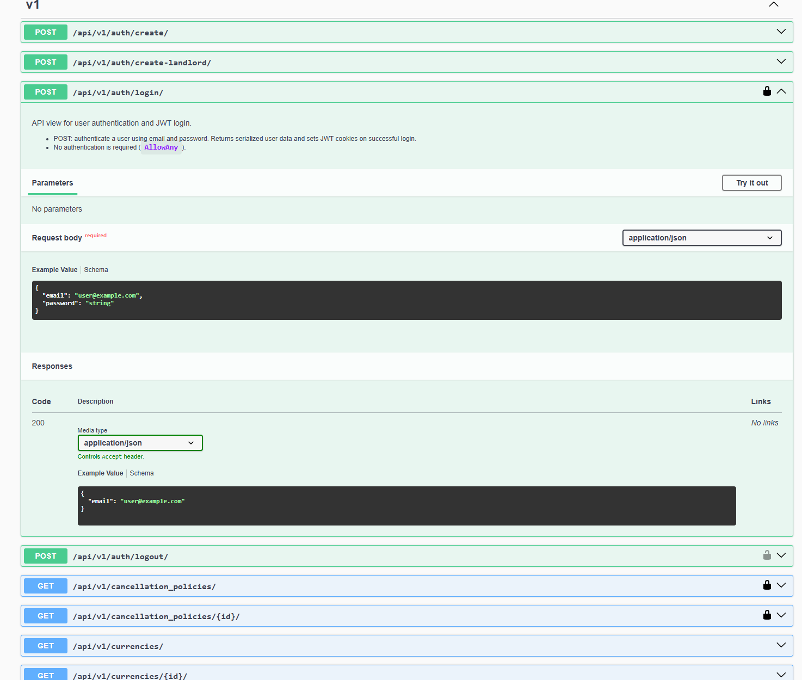
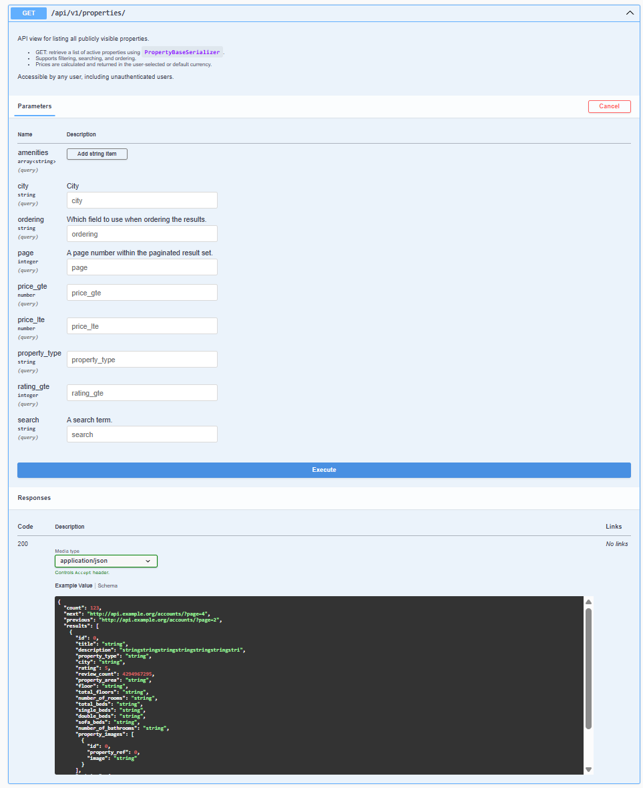

# RESTful API for a property booking platform

- Project Overview 
- Tech Stack
- Dependencies 
- Database 
- API Documentation
- Services Overview
- Planned Features

## 📝 Project Overview

<p align="content">
  BookingApp is an application for managing real estate reservations. It allows users to create profiles, add rental properties, search and filter offers, leave reviews, and manage reservations. The system supports discounts, currencies, and locations, as well as secure data deletion and anonymization when necessary. The project provides for the implementation of asynchronous processes and a full-fledged interface on React, which will be added in the next stages of development to improve usability and scalability.
</p>

## 🛠 Tech Stack

**_Current:_**

- 🐍 **Python** – backend logic and API
- ⚡ **Django REST Framework (DRF)** – RESTful API development
- 🐬 **MySQL** – relational database for structured data

**_Planned / Future Enhancements:_**

- 🚀 **Celery** – asynchronous task processing and scheduled jobs
- 🐳 **Docker** – containerization for easier deployment and environment management
- ⚛️ **React + Redux** – interactive frontend interface and state management
- 🌐 **HTML & CSS** – responsive and modern UI styling

## ⚙️ Dependencies 

**_Environment Setup_**

Before running the project, create a `.env` file in the root directory of your backend and fill in the following
variables:

```bash
# General
MYSQL=True
DEBUG=True
SECRET_KEY=your_secret_key_here
HASH_SALT=your_hash_salt_here
BASE_CURRENCY=your_currency_code_in_capital_characters

# Site & CORS
SITE_URL=http://localhost:8000
ALLOWED_HOSTS=127.0.0.1,localhost
CORS_ALLOWED_ORIGINS=http://localhost:3000
CORS_ALLOW_CREDENTIALS=True

# Tokens & API Keys
USER_TOKEN_SECRET=your_token_secret_here
GEOAPIFY_API_KEY=your_geoapify_key_here
EXCHANGERATE_API_KEY=your_exchangerate_key_here

# Database
DB_HOST=localhost
DB_PORT=3306
DB_USER=root
DB_PASSWORD=your_db_password_here
DB_NAME=properties

# Email
EMAIL_HOST=localhost
EMAIL_PORT=1025
EMAIL_USE_TLS=False
EMAIL_HOST_USER=Admin
EMAIL_HOST_PASSWORD=1234
DEFAULT_FROM_EMAIL=noreply@example.com

# Support Emails
SUPPORT_EMAIL_ADMIN=admin-team@site.com
SUPPORT_EMAIL_MODERATORS=moderators@site.com
SUPPORT_EMAIL_SUPPORT=support@site.com
```

**_📄 API keys_**

GEOAPIFY API key: [Get your API key here](https://www.geoapify.com/)

ExchangeRate API key: [Get your API key here](https://www.exchangerate-api.com/)

After creating the .env file, install dependencies:

```bash
pip install -r requirements.txt
```

Apply migrations:

```bash
python manage.py migrate
```

## 🛢️ Database

**_Populate initial data and fixtures_**

This command will load the **base data** into the database, including:

- Amenities
- Locations
- Currencies
- etc.

In the future, additional fixtures will also be added using the same command.

### Run the command:

```bash
python manage.py set_base_data
```

**Notes:**

- Make sure your `.env` file is correctly configured before running this command.
- This command is idempotent — running it multiple times will **update existing data without creating duplicates**.
- Future fixtures (like properties, users, discounts) will also be handled by this command as the project grows.
  Run the server:

## 🚀 Run the Server

**_Start the development server_**

After you have configured your `.env` file and loaded the base data (`python manage.py set_base_data`), start the Django
development server with:

```bash
python manage.py runserver
```

## 📄 API Documentation

**_Explore and test the API endpoints_**

All API endpoints are fully documented and interactive via **Swagger UI**.  
You can access it at:

`http://localhost:8000/api/docs/`

**_Examples_**

### User Login


### List Properties


## 💻 Services Overview

**_🌐 External Services_**

- **ExchangeRate API** ([https://www.exchangerate-api.com/](https://www.exchangerate-api.com/))
    - Ensures that property prices are always displayed with **up-to-date currency exchange rates**.
    - Used in backend calculations and pricing conversions between currencies.

- **Geoapify API** ([https://www.geoapify.com/](https://www.geoapify.com/))
    - Validates that **user-provided addresses are real and correctly formatted**.
    - Provides normalized location data, including latitude and longitude.

- **Notes:**
    - API keys are stored securely in the `.env` file (`EXCHANGERATE_API_KEY`, `GEOAPIFY_API_KEY`).
    - Future external services (like payment gateways or asynchronous tasks via Celery) will also be documented in this
      section.

**_🔧 Internal Services_**

- **Discount Management**
    - Periodically checks discount statuses: marks expired discounts and activates scheduled ones.
    - Applies relevant discounts to properties and authorized users.
    - Calculates final property prices after discount application.

- **Cascade Soft Deletion**
    - Soft deletes `User`, `LandlordProfile`, and `Property` models along with all related objects.
    - If a `LandlordProfile` represents a company, all associated employees are also deleted.
    - Ensures database consistency while retaining historical data.

- **Depersonalization Service**
    - Removes personal data from `User` and all related objects.
    - Replaces user references in related models with a user token.
    - Ensures privacy while keeping relational integrity.

- **Planned Review Services**
    - Services for handling reviews and ratings will be implemented in future updates.

## 🚀 Planned Features

**_Upcoming improvements and planned functionalities_**

- **Asynchronous & Scheduled Tasks**
    - Implement background jobs and scheduled operations using Celery (e.g., recurring discount updates, email
      notifications).

- **Review & Rating Services**
    - Backend services for handling user reviews, ratings, and feedback for properties.

- **Frontend Implementation**
    - Full React/Redux interface with HTML/CSS for user-facing pages and admin dashboards.

- **Email Notifications & Alerts**
    - Full-featured email notifications for users and admins (booking confirmations, system alerts).

- **Full Dockerized Stack**
    - Containerize the backend (and later the frontend) with Docker and Docker Compose.
    - Ensures consistent development environments, easy deployment, and isolated dependencies (Python, MySQL, Celery,
      etc.).
