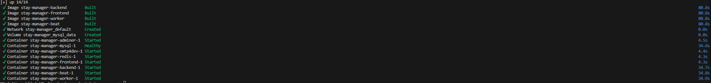
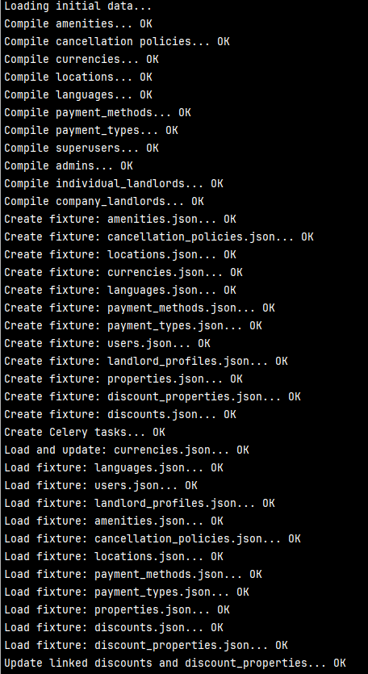
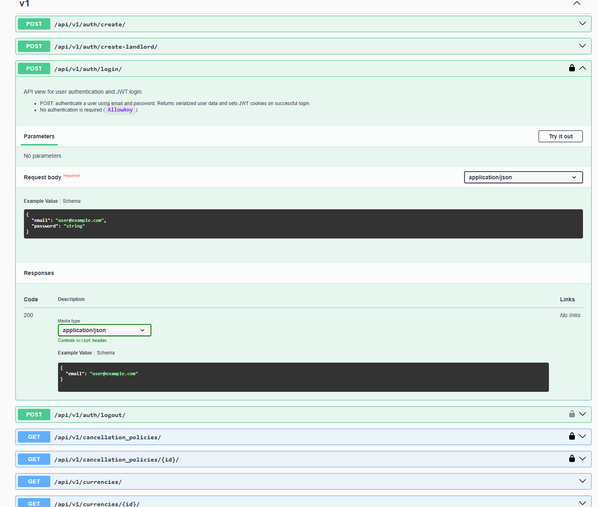
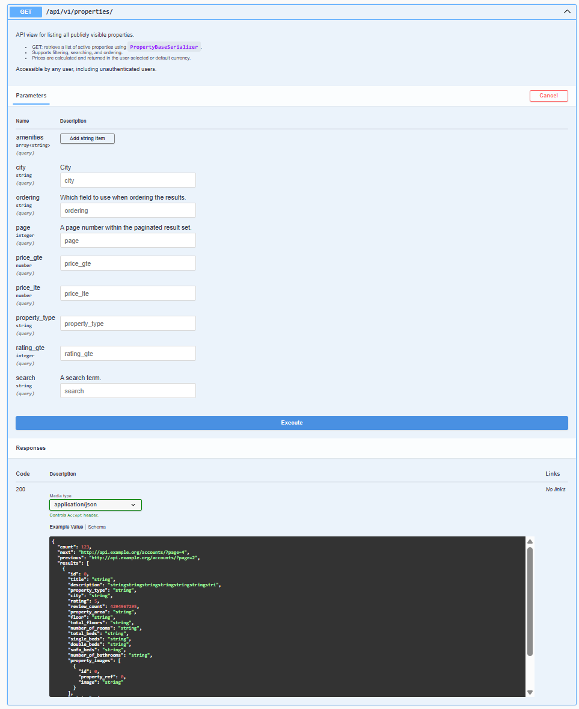

# RESTful API for a property booking platform

- Project Overview 
- Tech Stack
- Dependencies 
- Database 
- API Documentation
- Services Overview
- Planned Features
- Notes

## 📝 Project Overview

<p align="content">
Backend application for managing real estate reservations. It allows users to create and manage personal and property owner profiles, add rental properties, search and filter available offers, leave reviews, and handle bookings.

The application is built with Django REST Framework and provides a REST API for interacting with the system. It includes features such as discounts, support for multiple currencies, and location-based filtering.

The project runs in Docker, which allows all services (web application, backend, database, Redis, Celery Beat and Celery workers) to be started together in a consistent environment.

Celery with Redis is used for background task processing. This includes:

- asynchronous tasks triggered by API requests (for example, user deletion or processing data),
- scheduled tasks using Celery Beat (for periodic updates or cleanup tasks).

The project also includes handling of user data, such as deletion and anonymization when needed.

A frontend interface based on React is planned for future development to provide a more convenient user experience.
</p>

## 🛠 Tech Stack

**_Current:_**

- 🐍 **Python** – backend logic and API
- ⚡ **Django REST Framework (DRF)** – RESTful API development
- 🚀 **Celery + Celery Beat (Redis)** – asynchronous task processing and scheduled jobs
- 🐳 **Docker** – containerization for easier deployment and environment management
- 🐬 **MySQL** – relational database for structured data

**_Planned:_**

- ⚛️ **React + Redux Toolkit** – interactive frontend interface and state management
- 🌐 **HTML & CSS** – responsive and modern UI styling

## ⚙️ Dependencies

**_Environment Setup_**

1. Make a local copy of the repository. In the console, select the directory where the project repository will be cloned and Run the command:

```bash
git clone git@github.com:Ternario/Django-final-project.git
```

2. Create `.env.database` and `.env.backend` files in the root directory and fill in the following variables:

**.env.database**
```bash
DB_HOST= # example: mysql
MYSQL_DATABASE= # example: property-rental
MYSQL_ROOT_PASSWORD= # example: property-rental-root-password
MYSQL_USER= # example: property_root
MYSQL_PASSWORD= # example: property-rental-password
DB_PORT= # example: 3306
```

**.env.backend**
```bash
# General
DEBUG= # example: True
SECRET_KEY=your_secret_key_here
HASH_SALT=your_hash_salt_here

BASE_CURRENCY= # example: EUR
BASE_LANGUAGE= # example: EN

# Site & CORS
SITE_URL= # example: http://localhost:8000
ALLOWED_HOSTS= # example: localhost
CORS_ALLOWED_ORIGINS= # example: http://localhost:3000
CORS_ALLOW_CREDENTIALS= # example: True

# Tokens & API Keys
GEOAPIFY_API_KEY=your_geoapify_key_here
EXCHANGERATE_API_KEY=your_exchangerate_key_here

# Email
EMAIL_BACKEND= # example: django.core.mail.backends.smtp.EmailBackend
EMAIL_HOST= # example: localhost
EMAIL_PORT= # example: 25
EMAIL_USE_TLS= # example: False
EMAIL_USE_SSL= # example: False
EMAIL_HOST_USER= # empty for local dev
EMAIL_HOST_PASSWORD= # empty for local dev
DEFAULT_FROM_EMAIL= # example: noreply@example.com

# Support Emails
SUPPORT_EMAIL_ADMIN= # example: admin-team@site.com
SUPPORT_EMAIL_MODERATORS= # example: moderators@site.com
SUPPORT_EMAIL_SUPPORT= # example: support@site.com

# Celery
CELERY_BROKER_URL= # example: redis://redis:6379/0
CELERY_RESULT_BACKEND= # example: redis://redis:6379/0
```

**_API keys_**

GEOAPIFY API key: [Get your API key here](https://www.geoapify.com/)

ExchangeRate API key: [Get your API key here](https://www.exchangerate-api.com/)

## 🚀 Launch
Make docker images and run containers. 
- Start Docker or Docker Desktop (Windows)
- Run followed command in root directory:  

```bash
docker-compose up -d --build          
```

## Output:


**Notes:**
- Make sure your `.env.database` and `.env.backend` files are correctly configured before running this command.

## 🛢️ Database

**_Populate initial data and fixtures_**

The following command will create and load the **base data** into the database, run automatically in the container: 

```bash
python manage.py set_base_data
```

## Output:



**Notes:**
- If you need to re-insert the basic data into the database, Open the container's terminal:
```bash
docker exec -it <container_id> sh
```
- Run:
```bash
python manage.py set_base_data --force
```
- This command is idempotent — running it multiple times will **update existing data without creating duplicates**.
- You can find and modify the data templates at /backend/properties/fixtures/generators/data_templates

## 📄 API Documentation

**_Explore and test the API endpoints_**

All API endpoints are fully documented and interactive via **Swagger UI**.  
You can access it at:

`http://localhost:8000/api/docs/`

**_Examples_**

### User Login


### List Properties


**Notes:**
1. Users emails and passwords:
    - superuser1@example.com / UserPass01!-
    - admin1@example.com / UserPass02!-
    - individual1@example.com - individual3@example.com / (UserPass03!-) - (UserPass05!-)
    - company1@example.com - UserPass06!-
    - member1@example.com - member2@example.com / (UserPass07!-) - (UserPass08!-)
    - company2@example.com - UserPass09!-
    - member3@example.com - member6@example.com / (UserPass10!-) - (UserPass13!-)
    - user1@example.com - user5@example.com / (UserPass14!-) - (UserPass18!-)

2. All email examples, except for those for simple users, are specified in the fixture generator templates. 
Passwords are generated automatically (the variable part depends on the model ID). Simple users are created automatically, 
based on the number specified in the `count_of_simple_users` variable in the `build` file.

## 💻 Services Overview

**_🌐 External Services_**

- **ExchangeRate API** ([https://www.exchangerate-api.com/](https://www.exchangerate-api.com/))
    - Ensures that property prices are always displayed with **up-to-date currency exchange rates**.
    - Used in backend calculations and pricing conversions between currencies.

- **Geoapify API** ([https://www.geoapify.com/](https://www.geoapify.com/))
    - Validates that **user-provided addresses are real and correctly formatted**.
    - Provides normalized location data, including latitude and longitude.

- **Notes:**
    - API keys are stored securely in the `.env.backend` file (`EXCHANGERATE_API_KEY`, `GEOAPIFY_API_KEY`).
    - Future external services (like payment gateways or asynchronous tasks via Celery) will also be documented in this
      section.

**_🔧 Internal Services_**

- **Discount Management**
    - Periodically checks discount statuses: marks expired discounts and activates scheduled ones.
    - Applies relevant discounts to properties and authorized users.
    - Calculates final property prices after discount application.

- **Cascade Soft Deletion**
    - Soft deletes `User`, `LandlordProfile`, and `Property` models along with all related objects.
    - If a `LandlordProfile` represents a company, all associated employees are also deleted.
    - Ensures database consistency while retaining historical data.

- **Depersonalization Service**
    - Removes personal data from `User` and all related objects.
    - Ensures privacy while keeping relational integrity.

- **Review & Rating Service**
    - A service for recalculating the number of reviews and a property's rating.

## 🚀 Planned Features

**_Upcoming improvements and planned functionalities_**

- **Frontend Implementation**
    - Full React/Redux interface, with HTML/CSS for user-facing pages and admin dashboards.

- **Email Notifications & Alerts**
    - Full-featured email notifications for users and admins (booking confirmations, system alerts).


## 📄 Notes
- The fixture generator is currently designed only to populate basic data, with limited options for modifying template data. Future plans include refactoring to enable scalability, detailed control, and greater flexibility in the template data entered.

- At the moment, all services are fully functional, but they will be rewritten and optimized in the future to reduce the number of requests and the load on the database and server.